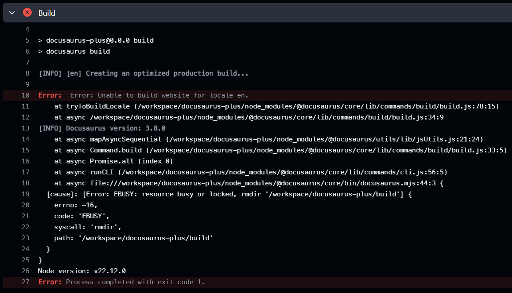

# 重構博客底層

超好笑，每次寫文章都是在重構博客

沒有心力寫文章，但是有心力重構（

上年 [又一次重開博客](https://cwksc.github.io/docusaurus-plus/blog/2024/07/02/first-post/) 講的就是重開了三次博客

從 Jekyll (2020) -> GitHub repository (2023) -> 最後選用 Docusaurus (2024)

這次架構和速度都有不少改動，從 2 分鐘變成 1 分鐘內，記錄一下

## 重構原因

1. GitHub Actions 失敗
2. 項目架構過於抽象 / 複雜，完全容器化
3. 改用 pnpm，各種增加建構速度的方法

### 1. GitHub Actions 失敗

當時（2024 年 7 月）Docusaurus 版本是 3.4.0，每次見他有新版本時都會升級，一直升級到 3.7.0

最近（2025 年 7 月）升 3.8.0 版本，GitHub Actions 失敗了



<!-- truncate -->

```javascript font-size="2"
[cause]: [Error: EBUSY: resource busy or locked, rmdir '/workspace/docusaurus-plus/build'] {
    errno: -16,
    code: 'EBUSY',
    syscall: 'rmdir',
    path: '/workspace/docusaurus-plus/build'
}
```

本機環境上沒有這個問題，因此嚴重懷疑是 GitHub Actions 中使用 Docker 的問題

也就是重構的第二個原因 —— 過於抽象，完全容器化

### 2. 項目架構過於抽象 / 複雜，完全容器化

抱著所有東西都 Reproducible（可重現） 的心態，將博客完全容器化

[Containerfile.develop](https://github.com/cwksc-organization/docusaurus-plus-backup-3.7-fail/blob/main/src/container/Containerfile.develop) 記錄項目從零開始建立的方式，利用 [volume mount](https://github.com/cwksc-organization/docusaurus-plus-backup-3.7-fail/blob/main/src/container/start.develop.ps1)，將需要的東西掛載到容器中，用 VSCode > `Dev Containers: Attach to Running Container` 進行開發

有點繁複，優點是所有東西都可重現

缺點是每次要啟動容器，需要先開一個像是 Docker 的 High-level Container Runtime，有底層東西改了需要 rebuild image，不能打開項目就直接 `npm install`, `npm start`

而且 GitHub Actions 中也要用 Docker build image，再在裏面執行 build，速度緩慢，大約花費 2 分鐘

即使在 [deploy.yml](https://github.com/cwksc-organization/docusaurus-plus-backup-3.7-fail/blob/main/.github/workflows/deploy.yml) 添加 `actions/cache@v4` 來緩存 image 亦無補於事（很神奇，竟然沒有變快也沒有變慢）

所以不如改用常規的項目方式，本地 create project, push GitHub repository

### 3. 改用 pnpm，各種增加建構速度的方法

- `pnpm`
- `experimental_faster` flag 加快建構速度
- GitHub Actions 緩存

#### `pnpm`

```bash
pnpm create docusaurus
```

#### `experimental_faster`

[Docusaurus 3.8.0](https://docusaurus.io/blog/releases/3.8) 提到可以用

```typescript
const config = {
  future: {
    experimental_faster: true,
  },
};
```

去啟用[這些](https://github.com/facebook/docusaurus/issues/10556)改進，主要改用 SWC 和 Rspack 加速構建，使用感覺的確快了很多

#### GitHub Actions 緩存

[deploy.yml](https://github.com/CWKSC/cwksc.github.io/blob/main/.github/workflows/deploy.yml)

根據 [pnpm/action-setup](https://github.com/pnpm/action-setup?tab=readme-ov-file#use-cache-to-reduce-installation-time), 緩存 `pnpm`

```yaml
uses: actions/setup-node@v4
with:
  node-version: 24
  cache: "pnpm"
  cache-dependency-path: docusaurus-plus/pnpm-lock.yaml
```

緩存 `.docusaurus` 和 `node_modules/.cache` 目錄

```yaml
uses: actions/cache@v4
with:
  path: |
    ./docusaurus-plus/.docusaurus
    ./docusaurus-plus/node_modules/.cache
  key: docusaurus-${{ runner.os }}-${{ hashFiles('docusaurus-plus/docusaurus.config.ts', 'docusaurus-plus/sidebars.ts') }}
  restore-keys: |
    docusaurus-${{ runner.os }}-
```

## 最後

從 push 到 build 到 deploy GitHub Page 速度在大約 50 秒

主要的 build 只用了大約 10 秒

之前用 Container 的做法大約要 90 秒，快了 9 倍

其餘都是很難再壓縮的 `actions/setup-node@v4` (10 秒), deploy (不穩定，7 - 30秒)

可以看 [Action Page](https://github.com/CWKSC/cwksc.github.io/actions) 所記錄的時間
