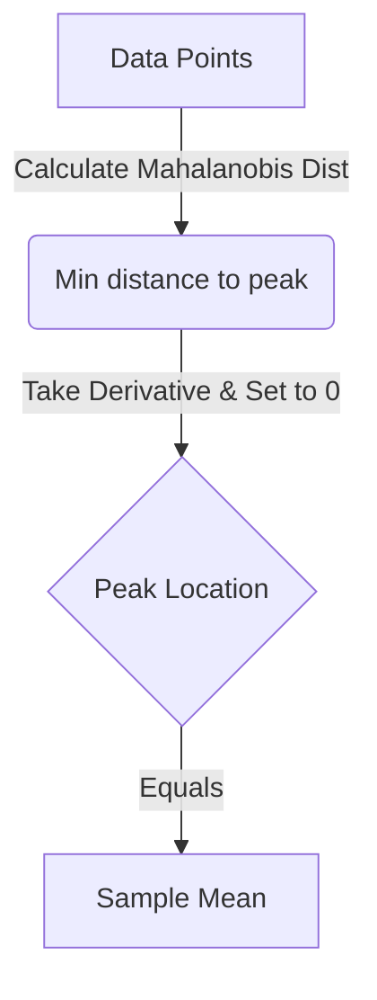

# Explanation: MLE for the Mean

## Intuition

If someone gives you a bunch of data points (say, the height and weight of several people) and asks you, "What's the most likely center of this data?" your immediate reaction would naturally be to calculate the average. 

This problem shows mathematically that for data following a Multivariate Gaussian (Normal) distribution, the **Maximum Likelihood Estimate (MLE)** of the center (mean vector $\mu$) is exactly what common sense dictates: the **sample mean**.

## The Likelihood Landscape

Imagine the data points are scattered in a 2D space. The Gaussian distribution forms a bell-shaped curve over this space. 
* We want to find the exact position of the "peak" (the mean $\mu$) of this bell curve such that the probability of having observed our given data points is maximized.
* The term $(x_i - \mu)^T \Sigma^{-1} (x_i - \mu)$ is a distance measure (called Mahalanobis distance) between a data point $x_i$ and the mean $\mu$, scaled by how stretched the bell curve is ($\Sigma^{-1}$). 

To maximize the probability, we must minimize these distances. 

## Why it Makes Sense

When we set the derivative to zero:
$$ \sum_{i=1}^N \Sigma^{-1} (x_i - \mu) = 0 $$
The $\Sigma^{-1}$ scales all dimensions but ultimately acts like a constant weight that doesn't change where the zero-point lies. The total "pull" or "error" $(x_i - \mu)$ from all points must balance out to exactly zero. 
The only point that perfectly balances the forces from all existing data points is the **center of mass**—which is the arithmetic average: $\frac{1}{N}\sum x_i$.

## Common Pitfalls

* **Matrix derivative rules**: Unlike scalar calculus where $x^2$ becomes $2x$, the derivative of a quadratic form $x^T A x$ gives $Ax + A^T x$. Forgetting that $A$ must be symmetric to simply call it $2Ax$ is a frequent mistake. Here, we correctly relied on $\Sigma$ being symmetric.