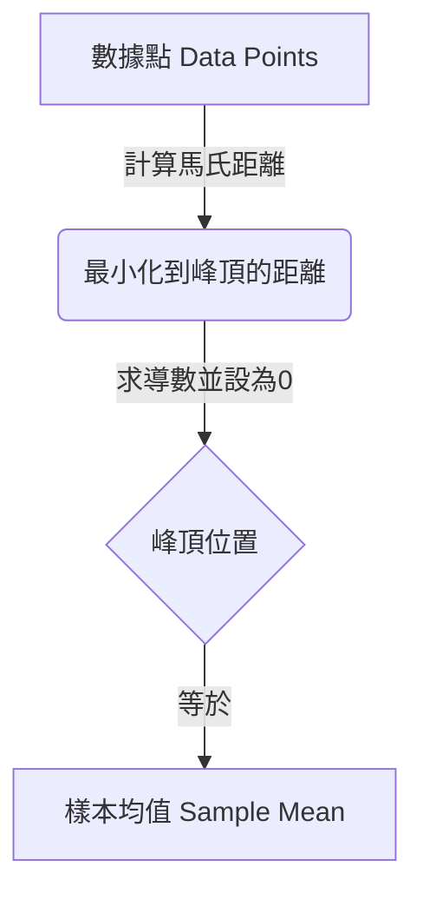

# 解釋：均值的最大似然估計 (MLE for the Mean)

## 直觀理解 (Intuition)

如果有人給你一堆數據點（例如，好幾個人的身高和體重），然後問你：「這些數據最可能的中心點在哪裡？」你的第一反應很自然會是去計算它們的平均值。

這個問題從數學上證明了，對於服從多變量高斯分佈 (Multivariate Gaussian Distribution) 的數據，其中心（均值向量 $\mu$）的**最大似然估計 (Maximum Likelihood Estimate, MLE)** 正好符合我們的常理判斷：也就是**樣本均值 (Sample Mean)**。

## 似然地形圖 (The Likelihood Landscape)

想像數據點散佈在一個二維空間中，高斯分佈在這個空間上方形成了一個鐘形曲線 (bell curve)。

- 我們想要找到這個鐘形曲線「峰頂」（也就是均值 $\mu$）的確切位置，使得觀察到我們現有這些數據點的概率 (probability) 最大化。
- 公式中的 $(x_i - \mu)^T \Sigma^{-1} (x_i - \mu)$ 是一個距離度量（稱為馬哈拉諾比斯距離, Mahalanobis distance），用來衡量數據點 $x_i$ 和均值 $\mu$ 之間的距離，並根據鐘形曲線的拉伸程度 ($\Sigma^{-1}$) 進行縮放。

為了最大化概率，我們必須最小化這些距離。

## 為什麼這很合理 (Why it Makes Sense)

當我們將導數設為零時：
$$ \sum\_{i=1}^N \Sigma^{-1} (x_i - \mu) = 0 $$
$\Sigma^{-1}$ 對所有維度進行了縮放，但最終它就像一個不會改變零點位置的常數權重。來自所有點的總「拉力」或「誤差」 $(x_i - \mu)$ 必須互相抵消至完全為零。
唯一能完美平衡所有現有數據點力量的位置，就是這群點的**質心 (center of mass)** —— 也就是算術平均值：$\frac{1}{N}\sum x_i$。

## 常見陷阱 (Common Pitfalls)

- **矩陣求導法則 (Matrix derivative rules)**：與標量微積分中 $x^2$ 的導數是 $2x$ 不同，二次型 (quadratic form) $x^T A x$ 的導數會給出 $Ax + A^T x$。經常有人會忘記必須在 $A$ 是對稱矩陣的前提下，才能簡化為 $2Ax$。在這裡，我們正確地利用了 $\Sigma$ 是對稱矩陣這個特性。
