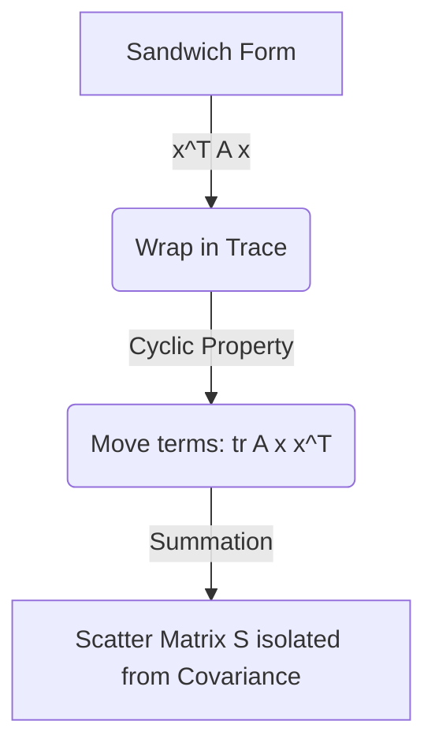

# Explanation: MLE for Covariance Matrix

## Intuition

In part (a), we figured out where the "center" of our data is (the mean). Now, in part (b), we seek to understand the **shape and spread** of our data around that center, which is encoded in the covariance matrix $\Sigma$.

The **Maximum Likelihood Estimate** is essentially asking: "What covariance shape makes the tightest optimal fit around our observed points?" The answer turns out to be the **sample covariance**—averaging the combined variance across all dimensions.

## The Trace Trick: Why do we use it?

During derivation, you might have wondered why we transformed $(x_i - \mu)^T \Sigma^{-1} (x_i - \mu)$ into $\text{tr}\left((x_i - \mu)(x_i - \mu)^T \Sigma^{-1}\right)$.

1. **Scalar Challenge**: The original formula is an intertwined vector-matrix-vector multiplication. Deriving a matrix $\Sigma$ out of the middle of this sandwich is algebraically difficult.
2. **Reordering with Trace**: Because the output is a single number (a scalar 1x1 matrix), we can safely wrap it in a Trace function. The cyclical property of Trace allows us to peel the vectors apart, grouping all data geometry into an outer product $(x_i - \mu)(x_i - \mu)^T$ independently of $\Sigma^{-1}$. 
3. **Scatter Matrix $S$**: By moving the summation inside the trace, we bundle all data information into a single matrix $S$. This gracefully reduces the complexity from "sum of $N$ quadratic expressions" to "one clean matrix trace operation."

## Making Sense of the Mathematics
If we look closer at the solution:
$$ \hat{\Sigma} = \frac{1}{N} \sum_{i=1}^N (x_i - \hat{\mu})(x_i - \hat{\mu})^T $$

We interpret $[(x_i - \hat{\mu})(x_i - \hat{\mu})^T]$ as the measured variance matrix extending from the single point $x_i$ towards the dataset mean. Summing these up and dividing by $N$ takes the "average shape" produced by these individual variances, forming our ultimate covariance estimate.

## Biased vs. Unbiased
* It is important to know that the Maximum Likelihood Estimate divides by $N$. This gives a **biased** estimator.
* For an **unbiased estimator**, we generally divide by $N-1$ (Bessel's correction). The MLE process purely optimizes probability based *only* on the observed sample context, causing the slight bias in variance.