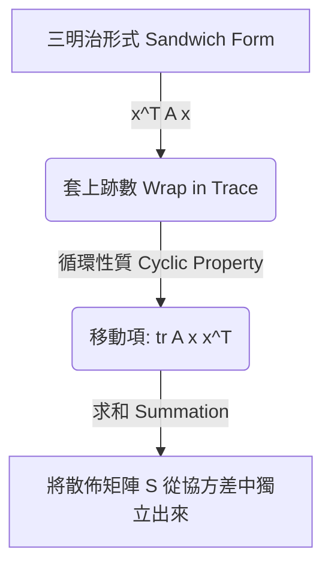

# 解釋：協方差矩陣的最大似然估計 (MLE for Covariance Matrix)

## 直觀理解 (Intuition)

在第 (a) 部分中，我們找出了數據的「中心點」（均值）。現在在第 (b) 部分，我們尋求理解在該中心周圍數據的**形狀與散佈程度 (shape and spread)**，這些資訊被編碼在協方差矩陣 (covariance matrix) $\Sigma$ 之中。

**最大似然估計 (Maximum Likelihood Estimate)** 本質上在問：「哪種協方差形狀能夠最緊密、最完美地擬合我們觀察到的點？」結果證明，答案正是**樣本協方差 (sample covariance)** —— 也就是將所有維度的綜合方差進行平均。

## 跡數技巧 (The Trace Trick)：為什麼要使用它？

在推導過程中，你可能會好奇為什麼我們要將 $(x_i - \mu)^T \Sigma^{-1} (x_i - \mu)$ 轉換成 $\text{tr}\left((x_i - \mu)(x_i - \mu)^T \Sigma^{-1}\right)$。

1. **標量的挑戰 (Scalar Challenge)**：原始公式是一個互相交織的 向量-矩陣-向量 乘法。要在這個三明治結構中對位於中間的矩陣 $\Sigma$ 求導，在代數上會非常困難。
2. **利用跡數重排 (Reordering with Trace)**：因為這個乘積的結果是一個單一數字（一個 1x1 的標量矩陣），我們可以安全地給它套上一個跡數 (Trace) 函數。跡數的循環性質允許我們將這些向量「剝開」，並獨立於 $\Sigma^{-1}$ 之外，將所有數據幾何形狀組合為一個外積形式 $(x_i - \mu)(x_i - \mu)^T$。
3. **散佈矩陣 (Scatter Matrix $S$)**：藉由把求和符號移到跡數內部，我們將所有數據的資訊整合成單一矩陣 $S$。這優雅地將複雜度從「$N$ 個二次表達式的和」降低為「單一個乾淨的矩陣跡數運算」。

## 理解數學背後的含義

如果我們仔細觀察最終解：
$$ \hat{\Sigma} = \frac{1}{N} \sum\_{i=1}^N (x_i - \hat{\mu})(x_i - \hat{\mu})^T $$

我們可以將 $[(x_i - \hat{\mu})(x_i - \hat{\mu})^T]$ 直觀理解為：從單一點 $x_i$ 測量到數據集均值所延伸出來的測量方差矩陣。將這些加總起來並除以 $N$，就拿到了由這些個別方差所形成的「平均形狀」，從而構築了我們最終的協方差估計值。

## 有偏與無偏 (Biased vs. Unbiased)

- 值得注意的是，最大似然估計除以的是 $N$。這會產生一個**有偏估計 (biased estimator)**。
- 若要求得**無偏估計 (unbiased estimator)**，我們通常會除以 $N-1$（貝塞爾校正, Bessel's correction）。MLE 過程只是純粹根據觀察到的樣本上下文來優化概率，從而導致在此方差估計上帶有輕微的偏差。
