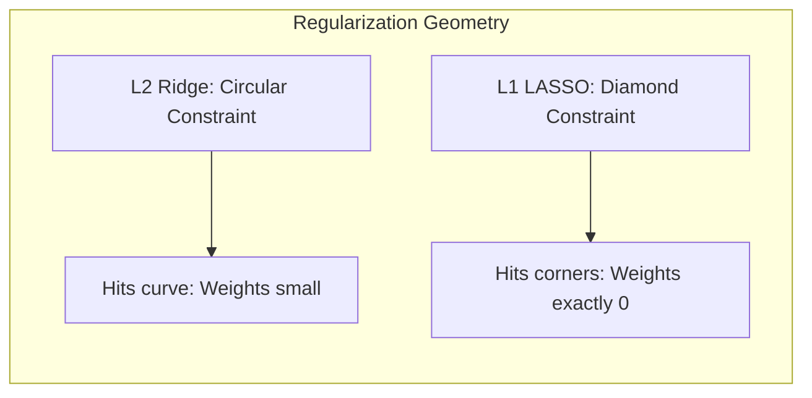

# Intuition Behind LASSO

Why does L1 regularization (LASSO) tend to make weights exactly zero, whereas L2 regularization (Ridge) only makes them small?

The secret lies in the underlying assumptions each method makes about how the weights *should* be distributed before it even sees the data. This "prior belief" acts as a gravitational pull on the learning process.

### The Shape of the Priors

Imagine a landscape representing the prior probabilities.
- **Ridge Regression (L2):** Assumes a **Gaussian (Normal) distribution**. This distribution looks like a smooth hill. Near the peak (zero), it is relatively flat. It tells the model: *"It's good to be close to zero, but being exactly zero isn't much better than being 0.001."*
- **LASSO (L1):** Assumes a **Laplace distribution**. This distribution looks like a steep mountain with a very sharp peak at zero. The probability drops off linearly on a log-scale, forming a sharp spike. It tells the model: *"You should be exactly zero unless the data gives you a very compelling reason not to be."*

### The Optimization Perspective (Geometric View)

Visually, we can think of optimizing these models as trying to expand a contour map of our data error until it touches a "constraint region" representing our prior.
- L2 regularization restricts the weights to lie within a **circle** (or sphere in higher dimensions). The error contours will usually touch the edge of the circle somewhere away from the axes. This means both weights will be small, but non-zero.
- L1 regularization restricts the weights to lie within a **diamond** shape (a square rotated by 45 degrees). The error contours are highly likely to hit the sharp corners of the diamond. Since these corners lie exactly on the axes, one or more weights will become exactly zero!

By heavily penalizing small non-zero weights and rewarding strict zeros through the Laplace prior, LASSO serves as a natural tool for **feature selection**—effectively ignoring the inputs that don't matter by switching their dials completely off.
