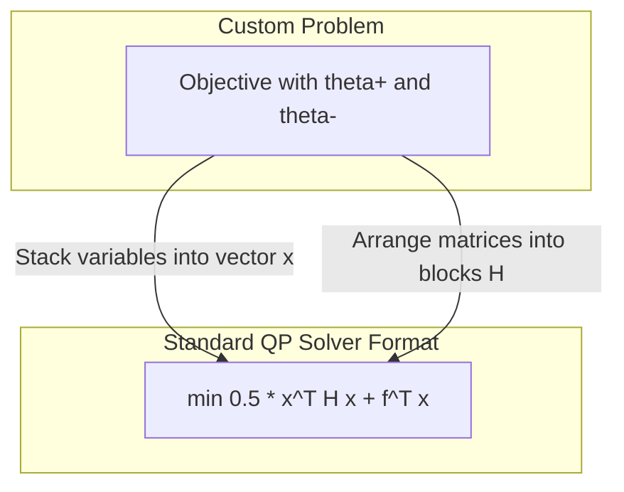

# Why Standard Forms Matter

After doing all the math in part (b) to escape the absolute value function, our problem is mathematically solvable, but practically, it's still written in terms of two separate sets of variables ($\theta^+$ and $\theta^-$).

Computer software libraries (like `scipy.optimize` in Python or `quadprog` in MATLAB) don't understand our custom machine learning notations. They are built to solve highly generalized, standardized mathematical templates.

### The Quadratic Programming (QP) Template

The "Quadratic Program" is a famous standard mold that takes the following shape:
"Minimize a bowl-shaped (quadratic) surface, subject to strict boundaries."

In math, this template expects:

1. A single unified vector of variables: $\mathbf{x}$.
2. A matrix describing the "bowl" curvature: $\mathbf{H}$.
3. A vector steering the "linear slope": $\mathbf{f}$.
4. A standard boundary condition, like $\mathbf{x} \ge 0$.

### Packing the Variables (The Trick)

To force our LASSO regression into this mold, we act like a factory worker packing boxes:

- We take our two separate vectors ($\theta^+$ and $\theta^-$) and stack them tightly on top of each other holding them in a single tall box called $\mathbf{x}$.
- Because we doubled the length of our variable vector, everything else must stretch to fit. The original matrices and vectors (like $\Phi\Phi^T$ and $\Phi y$) are cloned and arranged into a $2 \times 2$ block grid to correctly interact with the top half ($\theta^+$) and the bottom half ($\theta^-$) of our new tall vector $\mathbf{x}$.

By explicitly mapping our machine learning problem into the $(\mathbf{x}, \mathbf{H}, \mathbf{f})$ template, we can treat the actual optimization process as a "black box" and rely on decades of highly-optimized mathematical computing software to find the answer for us instantly.
