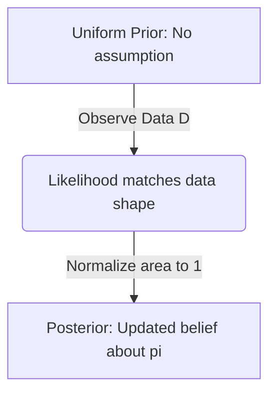

## Intuition

We want to update our belief about the probability of a coin coming up heads ($\pi$) after observing some coin flips ($\mathcal{D}$). Bayes' rule is the mathematical formulation of this "belief updating".

**Prior**: Starting out with a "uniform prior" means we have no idea whether the coin is biased or not. We think any probability between 0 and 1 is equally likely.

**Likelihood**: This is what the data tells us. If we flip the coin $n$ times and get $s$ heads, the likelihood is $\pi^s(1-\pi)^{n-s}$. The data "pulls" our belief towards the observed proportion of heads.

**Normalization**: To make sure our new belief (posterior) represents valid probabilities and sums to 1, we divide by the integral of all possibilities. The identity provided is just a mathematical shortcut to calculate this area. We end up with a Beta distribution. 

When $n=1$, we just flipped the coin once.
- If it landed Heads ($s=1$), our updated belief increases linearly towards $\pi=1$. It's more likely now that the coin favors heads. 
- If it landed Tails ($s=0$), our updated belief leans towards $\pi=0$.

