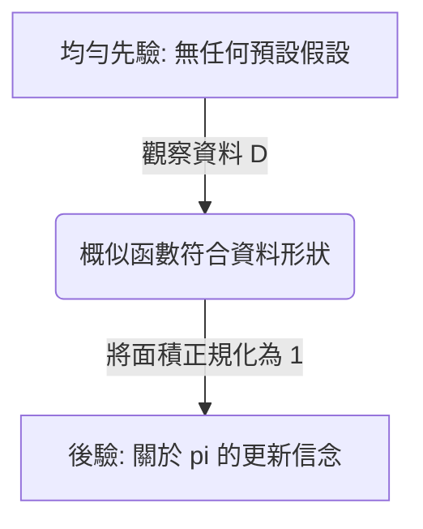

## 直觀理解 (Intuition)

我們希望在觀察到一些硬幣拋擲結果 ($\mathcal{D}$) 之後，更新我們對硬幣出現正面機率 ($\pi$) 的信念。貝氏法則就是這種「信念更新」的數學表達式。

**先驗 (Prior)**：一開始使用「均勻先驗 (uniform prior)」意味著我們完全不知道這枚硬幣是否被動過手腳。我們認為 0 到 1 之間的任何機率都是等可能的。

**概似 (Likelihood)**：這是資料告訴我們的資訊。如果我們拋擲硬幣 $n$ 次並得到 $s$ 次正面，概似函數就是 $\pi^s(1-\pi)^{n-s}$。資料會將我們的信念「拉向」觀察到的正面比例。

**正規化 (Normalization)**：為了確保我們的新信念（後驗，posterior）代表有效的機率並且總和為 1，我們除以所有可能性的積分。提供的恆等式只是一個用來計算這個面積的數學捷徑。我們最終得到的是一個貝塔分佈 (Beta distribution)。

當 $n=1$ 時，我們只拋擲了一次硬幣。
- 如果落地是正面 ($s=1$)，我們更新後的信念會朝著 $\pi=1$ 線性增加。現在硬幣偏向正面的可能性更高了。
- 如果落地是反面 ($s=0$)，我們更新後的信念就會向 $\pi=0$ 傾斜。

