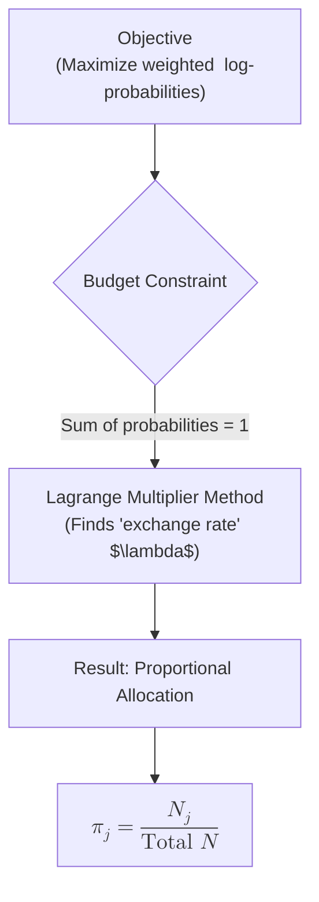

### Intuition

The objective we are trying to maximize, $\sum N_j \log \pi_j$, behaves like an unnormalized log-likelihood. Imagine you just observed an event happening $N_j$ times for the $j$-th outcome. To maximize the likelihood of those independent events under a categorical distribution, you want to assign higher probabilities ($\pi_j$) to components that have larger observed counts ($N_j$). 

Without any restrictions, this function would shoot off to infinity because we would just make every $\pi_j$ as large as possible.

However, we are restrained by a **budget constraint**: all the probabilities must sum exactly to 1 ($\sum \pi_j = 1$). You can think of this as having exactly $1.0$ (or $100\%$) worth of probability mass to distribute among $K$ different buckets.

### How Lagrange Multipliers Help
Lagrange multipliers provide an elegant way to deal with this budget. 

By setting up the Lagrangian $L = \text{Objective} - \lambda \times \text{Constraint}$, the parameter $\lambda$ acts as an internal "price" or "exchange rate" that enforces our budget.
* The derivative tells us that the optimal allocation is $\pi_j = \frac{N_j}{\lambda}$.
* This means the probability we assign to bucket $j$ should be directly proportional to its count $N_j$. 
* The multiplier $\lambda$ physically represents the total normalizing constant (the sum of all $N_k$ counts) needed to ensure the sum of $\pi_j$ equals 1.

### Common Pitfalls
* **Ignoring the multiplier**: Sometimes students will differentiate $\sum N_j \log \pi_j$ directly, getting $N_j/\pi_j = 0$, which is unsolved or undefined. You cannot optimize constrained probabilities without accounting for the sum-to-1 bound.
* **Forgetting that $\lambda$ is a shared constant**: In the step where we sum $\sum \frac{N_j}{\lambda} = 1$, remember that $\lambda$ has no $j$ subscript. It is the identical scaling factor applied to correct *every* probability simultaneously.
