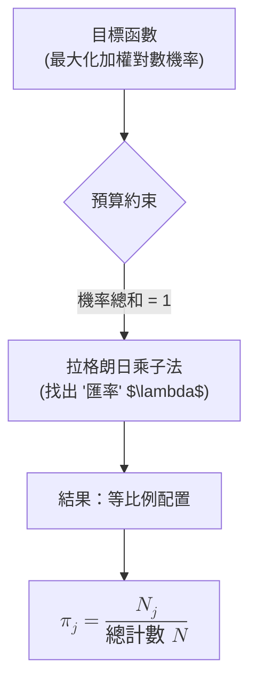

### 直覺概念 (Intuition)

我們要最大化的目標函數 $\sum N_j \log \pi_j$ 的行為像是一個未標準化的對數似然函數 (unnormalized log-likelihood)。想像你觀察到某個事件對於第 $j$ 個結果發生了 $N_j$ 次。為了在類別分佈 (categorical distribution) 下最大化這些獨立事件的似然機率，你傾向於將「觀察次數較大」($N_j$) 的組件賦予較高的「機率」($\pi_j$)。

在沒有任何限制的情況下，這個函數會無限發散，因為我們可以無止盡地將每一個 $\pi_j$ 加大。

不過，我們在這裡受到一個**預算約束 (budget constraint)**：所有機率加起來必須等於 1 ($\sum \pi_j = 1$)。你可以將它想像成我們將總共 $1.0$ (或是 $100\%$) 的機率權重 (probability mass) 限額，分配到 $K$ 個箱子中。

### 拉格朗日乘子法的用途 (How Lagrange Multipliers Help)

拉格朗日乘子 (Lagrange multipliers) 提供了一個非常優雅的方式來處理這種預算。

藉由設置拉格朗日函數 $L = \text{Objective} - \lambda \times \text{Constraint}$，參數 $\lambda$ 在這裡扮演的是一個「內部價格」或是「匯率」的作用來執行我們的預算分配。

- 對此求導數後我們得知，最佳配置方式為 $\pi_j = \frac{N_j}{\lambda}$。
- 這意味著我們塞到箱子 $j$ 的機率，應當與其計數 $N_j$ 成正比例。
- 乘子 $\lambda$ 實際上就代表了「總正規化常數 (total normalizing constant)」(也就是所有 $N_k$ 的總計數)，它可以用來確保所有的 $\pi_j$ 加在一起會剛好等於 1。

### 常見誤區 (Common Pitfalls)

- **忽略了乘子 (Ignoring the multiplier)**：有時候學生會直接針對 $\sum N_j \log \pi_j$ 取偏微分，然後得出 $N_j/\pi_j = 0$ 這種無解或無定義的錯誤結論。一旦有加總等於 1 的這個受限條件，你就不能在不受約束的情況下直接對機率進行最佳化。
- **忘記了 $\lambda$ 是個共用常數 (Forgetting that $\lambda$ is a shared constant)**：在計算 $\sum \frac{N_j}{\lambda} = 1$ 這個總和步驟時，必須記得 $\lambda$ 本身上頭並沒有 $j$ 的下標。它是作為一個恆等縮放因子 (scaling factor) 去同時且正確地糾正所有的機率。
