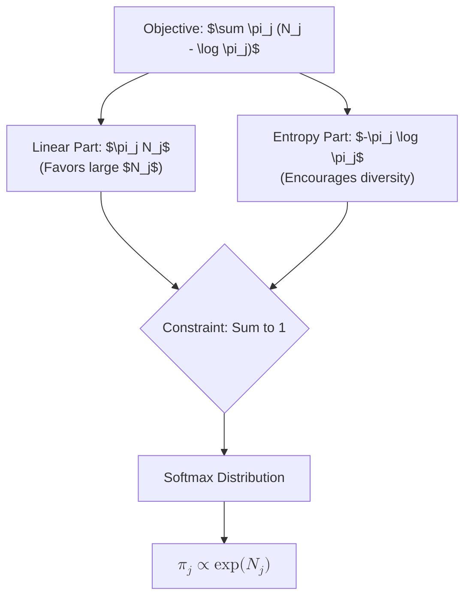

### Intuition

Unlike part (a) where the objective was purely $\sum N_j \log \pi_j$, the objective in part (b) takes the form $\sum \pi_j (N_j - \log \pi_j)$. We can split it into two competing forces:
1. **The Linear Pull ($\sum \pi_j N_j$)**: This part wants to place all the probability mass on the single $j$ that has the largest $N_j$ score. If this term was alone, the solution would be purely deterministic (assigning $1.0$ to the winner and $0.0$ to everything else).
2. **The Entropy Push ($-\sum \pi_j \log \pi_j$)**: This is the formula for Shannon Entropy. Entropy measures uncertainty or "smoothness." Maximizing entropy pushes the probabilities to be as uniform (spread out) as possible, actively resisting the urge to group all probability mass onto a single winner.

By combining these two, the optimization problem behaves as a trade-off: **Favor the states with high $N_j$, but maintain a diverse distribution.**

### The Softmax Function

The result directly yields the **Softmax Function**:
$$ \pi_j = \frac{\exp(N_j)}{\sum_{k=1}^K \exp(N_k)} $$

This is an incredibly ubiquitous function in Machine Learning (particularly neural networks) used to transform arbitrary scores $N_j$ (logits) into a valid probability distribution.
* **Non-negativity**: The exponential function $\exp(x)$ ensures that any negative logic score becomes a slightly positive probability.
* **Sum to 1**: The denominator exactly counterweighs the numerators so they act as relative fractions of the whole.

### Common Pitfalls
* **Logarithm Rules**: A frequent error takes place during the differentiation of $-\pi_j \log \pi_j$. Remembering to apply the Product Rule ($f'g + fg'$) avoids the common mistake of concluding the derivative is merely $-\log \pi_j$ roughly. Instead, it yields $-\log \pi_j - 1$.
* **Mistaking the constraint**: Similar to part (a), the multiplier must be factored out carefully using exponent rules: $\exp(-1-\lambda)$ separates multiplicatively rather than additively.
