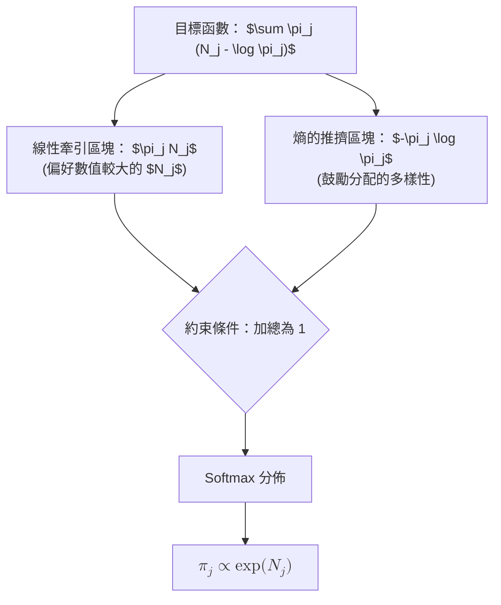

### 直覺概念 (Intuition)

不同於 (a) 小題中單純只含有 $\sum N_j \log \pi_j$ 的目標，在 (b) 小題裡面的目標函數形式為 $\sum \pi_j (N_j - \log \pi_j)$。我們可以把它拆解爲兩股相互競爭的力量：
1. **線性牽引 (The Linear Pull) ($\sum \pi_j N_j$)**：這一部份傾盡全力想把全數的機率權重投放在擁有最大分數 $N_j$ 的單一索引 $j$ 之上。如果只有這項存在，解就會是完全確定性的 (給最強者 $1.0$ 的機率，其餘全為 $0.0$)。
2. **熵的推擠 (The Entropy Push) ($-\sum \pi_j \log \pi_j$)**：這其實就是香農熵 (Shannon Entropy) 的公式。熵衡量的是不確定性或是「平滑程度」。對熵進行最大化會將機率分配推往盡可能均勻的狀態（彼此分散開來），這積極地抵抗了把全數權重集中在單一贏家身上的拉力。

藉由將這兩者結合在一起，這個最佳化問題就變成了一種博弈式的權衡 (trade-off) 行為：**它偏好取值越高的 $N_j$ 狀態，但在同時會維持具備多樣性的一個概率分佈**。

### Softmax 函數 (The Softmax Function)

其衍生的直接結果就是得到了 **Softmax 函數 (Softmax Function)**：
$$ \pi_j = \frac{\exp(N_j)}{\sum_{k=1}^K \exp(N_k)} $$

這是機器學習 (特別在神經網路模型) 領域中幾乎無所不在的一個函數，專門用來將任意帶有評分的 $N_j$ (logits) 正規轉換成有效且和為一的機率分佈 (probability distribution)。
* **非負性 (Non-negativity)**：憑藉自然指數函數 $\exp(x)$，可以確保哪怕是負邏輯強度的分數，也能被對應轉換成微小但不為負的正值機率。
* **加總為 1 (Sum to 1)**：分母上的總和精確用作抵銷分子計算產生的數值，使它們變為表示整體相對份額的百分比。

### 常見誤區 (Common Pitfalls)
* **對數微積分錯誤 (Logarithm Rules)**：在針對 $-\pi_j \log \pi_j$ 進行偏導數求解時極容易犯錯。得緊記務必應用乘積法則 (Product Rule，即 $f'g + fg'$ ) 來求偏導，這可以防範將結果誤認為只有 $-\log \pi_j$ 的低級失誤，正確的導數求解為 $-\log \pi_j - 1$。
* **弄錯常數拘束項 (Mistaking the constraint)**：跟 (a) 小題情況極為相像，得謹慎操作指數相加規則，把乘子平順地分離提出：$\exp(-1-\lambda)$ 在這裡得用乘法抽離出常數縮放基數，而不是以常數相加的方式移除。
