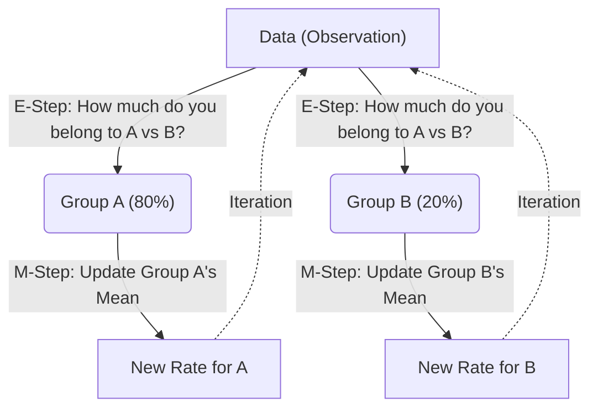

# Intuition

Imagine you have a big bag of mixed M&Ms, but the bag actually came from mixing two different smaller bags. Bag A had mostly Blue M&Ms (high rate), and Bag B had mostly Red M&Ms (low rate of Blue). If you just pull out handfuls, you find different numbers of Blue M&Ms. You want to know the "rate" of Blue M&Ms in Bag A and Bag B separately, but you don't know which handful came from which bag!

This is exactly what the **Expectation-Maximization (EM) algorithm** tries to solve. We have bombing data across a city, but some areas were targeted (high rate of bombs) and some were not (low rate of bombs). We want to find these rates without knowing which area is which.

### 1. The E-Step: Soft Guessing

Instead of forcing a hard decision ("Area 1 was definitely targeted"), the EM algorithm makes a **soft guess** ("I am 80% sure Area 1 was targeted, and 20% sure it was just collateral damage").

We calculate these probabilities using Bayes' Theorem. The term $\gamma_{ij}$ (called the _responsibility_) simply answers: _"Given the number of bombs that fell here, and my current guess for the target/non-target rates, how likely is it that this area belonged to group $j$?"_

### 2. The M-Step: Weighted Averages

Once we have our "soft guesses" for every area, we need to update our estimate of the actual hit rates ($\lambda$).

If we knew _exactly_ which areas were targets, we would just calculate the average bombs per target area (which is the Maximum Likelihood Estimate from Problem 2.1). But because we only have soft guesses, we calculate a **weighted average**.

If Area 1 has 5 bombs, and we are 80% sure it's a target area, we give $5 \times 0.8 = 4$ bombs to the targeted group's "bucket" and $5 \times 0.2 = 1$ bomb to the non-targeted group's "bucket". We sum these up across all areas and divide by the total "weight" (sum of percentages) assigned to that group.

### Analogy: The "Soft Clustering" Concept

We loop between the E-Step and the M-Step until the numbers stop changing significantly. This proves we've reached a stable, logical conclusion about the targeted vs. non-targeted rates.
