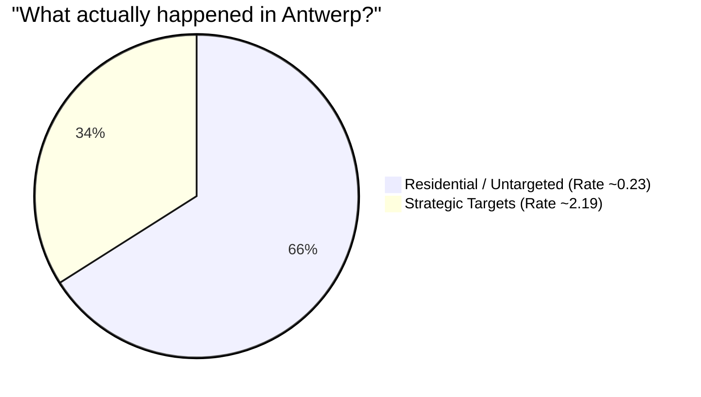

# Intuition

How can we look at a simple table of counts—0 hits, 1 hit, 2 hits—and definitively say "Ah, the enemy was aiming at specific targets?" 

It all comes down to the fundamental nature of randomness, and figuring out what the data *should* look like if the bombing was completely blind. 

### Pure Randomness vs. Clusters

A single **Poisson Distribution** acts as the baseline for "purely random." If you close your eyes and randomly throw darts at a map of a city, the number of darts per city block will naturally follow a Poisson curve. Some blocks get zero, some get one or two, and a rare few might get three or four—just by pure luck. 

A defining mathematical feature of "pure randomness" (a single Poisson) is that its **Mean** (the average hits per block) must equal its **Variance** (how spread out the counts are). 

Let's look at the two cities:

**London:**
*   Mean $\approx 0.93$
*   Variance $\approx 0.93$
*   *Observation:* Because Mean = Variance, the data almost perfectly mirrors a single random process ($K=1$). The bombs were flying blind and raining down evenly as a single, untargeted barrage.

**Antwerp:**
*   Mean $\approx 0.90$
*   Variance $\approx 1.74 \to$ **High Variance!**
*   *Observation:* This is called **Overdispersion**. The counts are stretched way too far apart to be random. There are too many 0's (325 areas) and dangerously many 5+'s (21 areas); the "middle" numbers are hollowed out. 

### The $K=2$ Mixture Solution
When we feed the Antwerp data into the EM algorithm from part (a) to look for a mixture of Poisson distributions, it easily finds two vastly different groups hiding inside the data.

It splits the map into:
1.  **A "Safe" Zone:** Makes up roughly 2/3 of the squares. These barely ever get hit (average 0.23 hits).
2.  **A "Danger" Zone:** Makes up exactly 1/3 of the squares. These are hammered constantly (average 2.19 hits).

This tells a clear story: The attacks on Antwerp weren't random at all. The attackers were trying very hard to hit specific targets (like the port of Antwerp), making "Danger Zones" out of 1/3 of the city, while the rest of the city mostly suffered from stray misses.