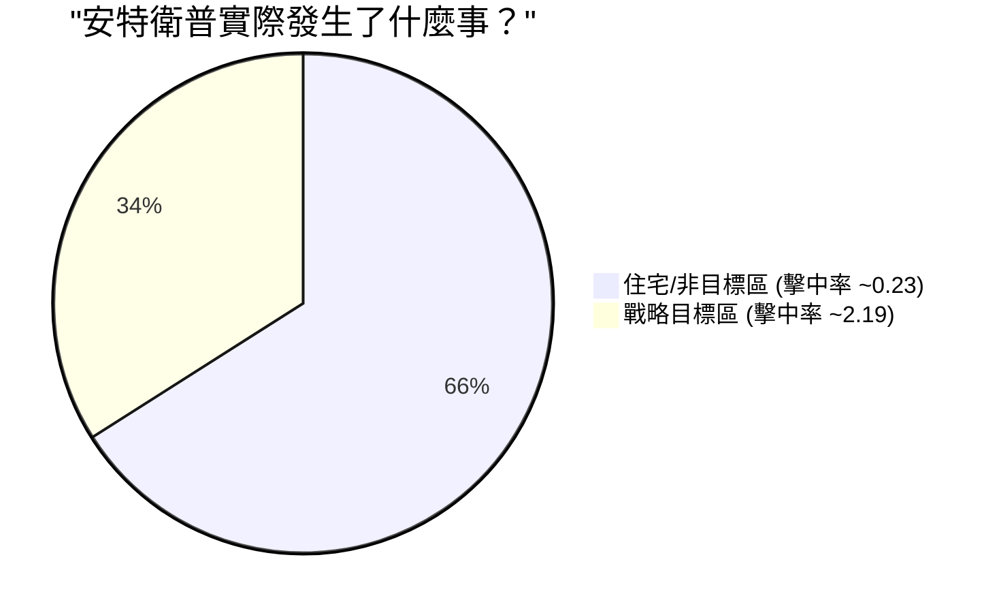

# 直覺解析 (Intuition)

我們怎麼能單純看著一張包含被擊中 0 次、1 次、2 次這類計數表格，就能斬釘截鐵地說「啊，敵人正在瞄準特定目標」呢？

這一切都回歸到隨機性的本質，並釐清如果轟炸是完全盲目的，數據「應該」要長什麼樣子。

### 純隨機 (Pure Randomness) vs. 聚類現象 (Clusters)

單一的 **卜瓦松分佈 (Poisson Distribution)** 能夠作為「純隨機」的基準線。如果你閉上眼睛，隨機向城市地圖投擲飛鏢，每個城市街區的飛鏢數量自然會遵循卜瓦松曲線 (Poisson curve)。有些街區一個也沒中，有些會中一兩支，只有極少數可能幸運地被射中三或四支。

「純隨機」（單一卜瓦松分佈）的一個決定性的數學特徵是，它的**平均值 (Mean)**（每個街區被擊中的平均數）必須等於其**變異數 (Variance)**（計數的分散程度）。

讓我們看看這兩個城市：

**倫敦 (London)：**

- 平均值 $\approx 0.93$
- 變異數 $\approx 0.93$
- _觀察結果：_ 因為 平均數 = 變異數，這些數據近乎完美地反映了單一的隨機過程 ($K=1$)。炸彈是盲目飛來的，像一場無差別、均勻的暴雨一樣落下。

**安特衛普 (Antwerp)：**

- 平均值 $\approx 0.90$
- 變異數 $\approx 1.74 \to$ **高變異數！**
- _觀察結果：_ 這種現象被稱為 **過度離散 (Overdispersion)**。計數的分散程度太大，不可能是隨機的。0 次擊中的數量太多（325 個區域），而 5 次及以上的數量又危險地多（21 個區域）；相反地，「中間」的數字卻被掏空了。

### $K=2$ 混合模型的解答

當我們把安特衛普的數據餵給在 (a) 部分所做的 EM 演算法，以尋找混合卜瓦松分佈時，它輕鬆地在數據內找出了隱藏著的兩個截然不同的群組。

它將地圖分成了：

1.  **「安全」區 (Safe Zone)：** 約佔了地圖三分之二的網格。幾乎很少被擊中（平均 0.23 次）。
2.  **「危險」區 (Danger Zone)：** 剛好佔了地圖三分之一的網格。持續不斷遭到猛烈轟炸（平均 2.19 次）。

這訴說著一個清楚的故事：安特衛普遭受的攻擊絲毫不隨機。攻擊者非常努力地想打擊特定的目標（例如安特衛普港），使得城市中 1/3 的區域變成了「危險區」，而城市的其餘部分大多只是承受了偏離目標的流彈。
