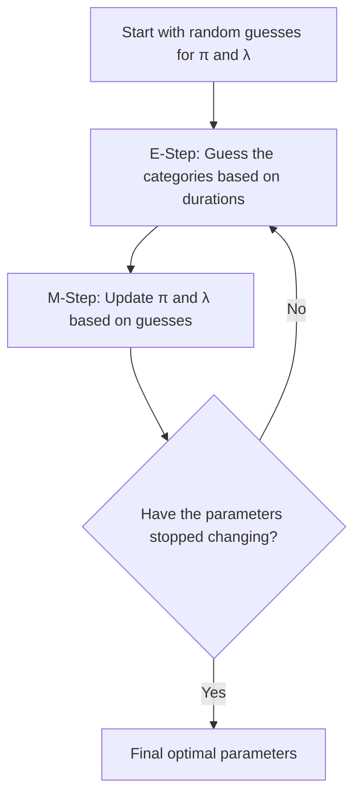

## Intuition Behind the EM Algorithm for Exponential Mixtures

Imagine you work at a busy customer service call center, and you are trying to understand how long phone calls last. However, there are $K$ different types of inquiries—for example, simple password resets (short calls) and complex technical support (long calls). The duration of a call for any specific category naturally follows an **exponential decay** (most calls are short, but a few drag on). 

The problem is: when looking at the call logs (the data $x_i$), you only see the *duration* of the call, but the system didn't record *which category* (the latent variable $z_i$) the call belonged to!

If you knew the categories exactly, you could easily calculate the mixture weights $\pi_j$ (the percentage of calls for each category) and the rate $\lambda_j$ (inverse of the average call duration for that category). Because you don't know the categories, you face a chicken-and-egg problem. This is where the **Expectation-Maximization (EM) algorithm** steps in.

### The EM Cycle

The EM algorithm tackles this by alternating between two intuitive steps until it locks onto a stable solution:

#### E-Step: The "Soft Guess" (Expectation)
Instead of rigidly assigning each call to a single category (e.g., saying a 3-minute call is exactly Category 1), we assign a "soft probability" or **responsibility** ($\gamma_{ij}$).
* *If we guess the categories have certain average times and proportions...*
* For a specific 3-minute call, we ask: "What is the probability it was a password reset versus a technical support issue, given our current parameters?"
* We do this for every call, calculating how much responsibility each component has for generating that data point.

#### M-Step: The "Update" (Maximization)
Now we pretend our "soft guesses" are the absolute truth and update our parameters.
* **Updating $\pi_j$ (Proportions):** We sum up all the fractional responsibilities for category $j$ and divide by the total number of calls $n$. Physically, it's simply the average of our soft guesses for that category!
* **Updating $\lambda_j$ (Rates):** For the standard exponential distribution, the maximum likelihood estimate for the rate $\lambda$ is $1 / \text{average value}$. Here, we do the exact same thing, but it's a **weighted average**. We sum up all call durations, weighted by the probability that they belong to category $j$, and divide the effective number of calls for category $j$ by that weighted sum.

### Common Pitfalls
* **Local Optima:** The EM algorithm doesn't guarantee finding the *global* best solution, only a *local* one. Because of this, it is highly dependent on initialization. Running it multiple times with different starting parameters is a common practice.
* **Why not a simple average?** Notice the M-step for $\lambda_j$ updates it to $N_j / \sum(\gamma_{ij} x_i)$. This is exactly the inverse of the weighted empirical mean: $\sum(\gamma_{ij} x_i) / N_j$. This perfectly matches the core property of an exponential distribution where the mean $\mu = 1/\lambda$.
