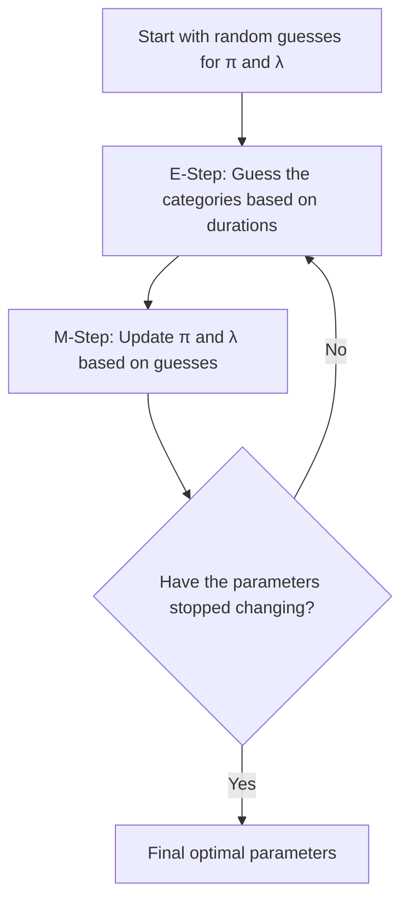

## 指數混合模型中 EM 演算法的直觀理解 (Intuition Behind the EM Algorithm for Exponential Mixtures)

想像一下，你在一個繁忙的客服呼叫中心工作，試圖了解通話到底持續了多久。然而，總共有 $K$ 種不同的客服詢問類型——例如，簡單的密碼重置 (通話時間短) 和複雜的技術支援 (通話時間長)。任何特定類別通話持續的時間自然遵循**指數衰減 (exponential decay)** (大多數通話都很短，但少數會拖得很長)。

問題在於：在查看通話記錄 (數據 $x_i$) 時，你只看到通話的**持續時間 (duration)**，但系統並沒有記錄這通電話屬於**哪個類別** (這個未知的類別就是潛在變數 $z_i$)！

如果可以明確知道所屬類別，你就能輕鬆計算混合權重 $\pi_j$ (每個類別佔的通話百分比) 和速率 $\lambda_j$ (該類別平均通話時間的倒數)。正是因為你不確定類別歸屬，這變成了一個「雞生蛋，蛋生雞」的問題。這就是**期望最大化演算法 (EM algorithm)** 派上用場的地方。

### EM 循環 (The EM Cycle)

EM 演算法透過在兩個直觀的步驟之間交替來解決這個問題，直到它鎖定一個穩定的解決方案：

#### E步：軟猜測 ("Soft Guess" / Expectation)

與其死板地將每個通話分配給單一類別 (例如，硬性規定 3 分鐘以上的通話就一定是複雜問題)，我們賦予每個類別一個「軟性機率 (soft probability)」或**責任值 (responsibility)** ($\gamma_{ij}$)。

- _如果我們初步猜測各類別擁有的平均通話時間跟佔比..._
- 對於一通 3 分鐘的具體來電，我們會問：「在當前參數設定下，它是密碼重置與技術支援的機率分別是多少？」
- 我們對每一通電話都執行這項操作，計算每個成分在「生成這個數據點」上需要負擔的責任大小。

#### M步：更新參數 ("Update" / Maximization)

現在我們假裝這些「軟猜測 (soft guesses)」就是絕對事實，並藉以更新我們的參數。

- **更新 $\pi_j$ (比例, Proportions)：** 我們將類別 $j$ 的所有小數責任值加總，並除以總通話次數 $n$。物理意義上來說，這就是我們給對該類別的軟猜測值的平均！
- **更新 $\lambda_j$ (速率, Rates)：** 對於標準的指數分佈，速率 $\lambda$ 的最大概似估計 (MLE) 通常是 $1 / \text{平均時間}$。在這裡，我們作法完全一樣，只不過是一個**加權平均 (weighted average)**。我們把所有通話持續時間依照它們屬於類別 $j$ 的機率進行加權並加總。最後用該類別的有效總通話次數除以這個加權總時間。

### 常見陷阱 (Common Pitfalls)

- **局部最佳解 (Local Optima)：** EM 演算法不保證尋找到**全域 (global)** 最佳解，只保證找到**局部 (local)** 最佳解。因此，它高度依賴參數初始化。實作中，使用不同的起始參數運行多次是一種常見的做法。
- **為什麼不是簡單的平均？** 注意在 $\lambda_j$ 的 M 步公式中更新為 $N_j / \sum(\gamma_{ij} x_i)$。它正好是加權經驗平均數 $\sum(\gamma_{ij} x_i) / N_j$ 的倒數。這完美契合了指數分佈中的核心性質，即：平均數 $\mu = 1/\lambda$。
