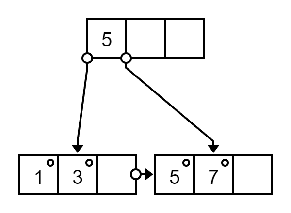
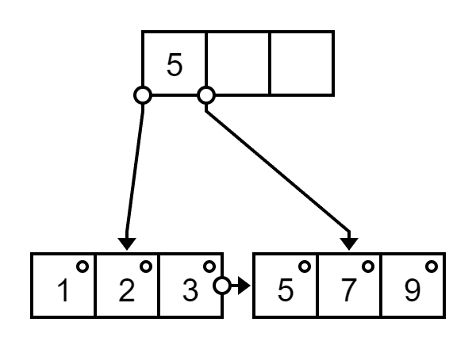
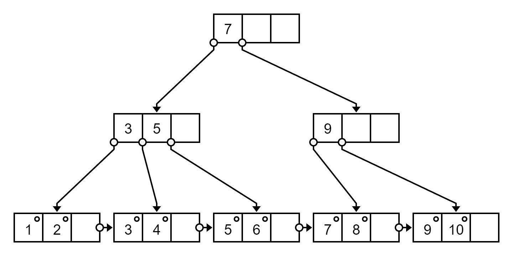
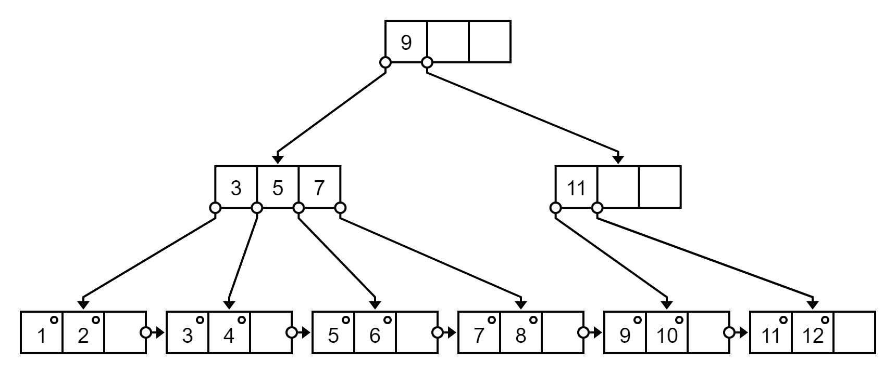
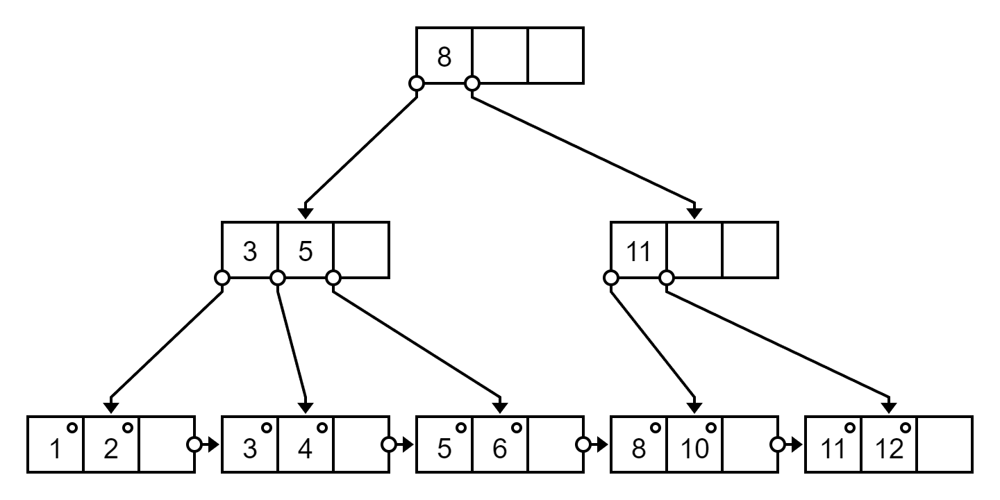
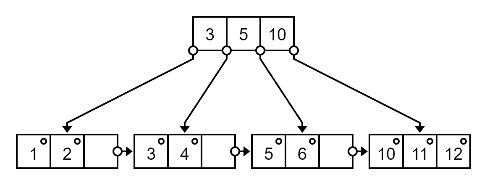

# B / B+ Tree

## Visualization Tool / Simulator

[B-Sketcher (also for B+ Tree)](https://projects.calebevans.me/b-sketcher/)

[B+ Tree Visualization](https://www.cs.usfca.edu/~galles/visualization/BPlusTree.html)

## B Tree

[B樹 - 維基百科，自由的百科全書](https://zh.wikipedia.org/wiki/B%E6%A0%91)

[[資料結構]B-tree - Chacha - Medium](https://medium.com/@chacha0519/%E8%B3%87%E6%96%99%E7%B5%90%E6%A7%8B-b-tree-f33fdd09d5db)

[【資料結構】平衡搜索樹 - 紅黑樹、B樹(2-3,2-3-4樹)、B+樹 | Z1N's house](https://z1nhouse.github.io/post/5lQAWUQWk/#%E4%BD%95%E8%AC%82%E5%B9%B3%E8%A1%A1%E6%90%9C%E7%B4%A2%E6%A8%B9)

> Binary Search Tree 有個致命缺點，就是當這個樹狀資料結構不平衡時會使這個資料結構喪失其優勢

Use 平衡搜索樹（Balanced Search Tree）

- AVL Tree
- Red Black Tree 紅黑樹
- B Tree (Family)

For B Tree

- 每個 node 最多有 m 個子樹 (最多m-1個元素) (m is `order`)
- 所有 leaf 在同一層上
- internal 內部節點 

> 當插入資料會超過此節點所限制數量 m 時，B-tree 會進行分裂

> 左小右大

## Insertion 插入

> 所有的插入都從根節點開始
> 
> 如果節點擁有的元素數量小於最大值 m
> 插入到這一節點，且保持節點中元素有序
> 
> 否則，這一節點已經滿了，平均地分裂成兩個節點：
> - 從該節點的原有元素和新的元素中選擇出中位數
> - 小於這一中位數的元素放入左邊節點，大於這一中位數的元素放入右邊節點，中位數作為分隔值
> - 分隔值被插入到父節點中，這可能會造成父節點分裂，分裂父節點時可能又會使它的父節點分裂，以此類推
> - 如果沒有父節點（這一節點是根節點），就建立一個新的根節點（增加了樹的高度）

## Deletion 刪除

> TODO

## B+ Tree

[B+ tree - Wikipedia](https://en.wikipedia.org/wiki/B%2B_tree)

> B+ 樹背後的想法是內部節點可以有在預定範圍內的可變數目的子節點
> 
> 因此，B+ 樹不需要像其他自平衡二叉搜尋樹那樣經常的重新平衡

For children / subtree

> Node can have a maximum of `m` children (subtree)
> 
> Node should have a minimum of `ceil(m / 2)` children (subtree)

For keys / elements

> Node (except root node) should contain a minimum of `ceil(m / 2) - 1` keys (element)
>
> Node can contain a maximum of `m - 1` keys (element)

> 所有 leaf node 鏈結成一個單鏈表

All key in leaf node

## Left / right biasing

[Databases: left biasing and right biasing in B+ tree insertion](https://gateoverflow.in/91462/left-biasing-and-right-biasing-in-b-tree-insertion)

插入並且分裂時左邊 key 比較多還是右邊 key 比較多 (ceil vs floor in left right)

In compare element

Left biasing use \<= and >

Right biasing use \< and \>=

Wiki use left biasing, but most of the example in internet use right biasing (also in school teaching)

Result of left / right biasing with same insert order can be different (even can be different in depth of tree)

## Insertion 插入 (right biasing)

[5.29 B+ Tree Insertion | B+ Tree Creation example | Data Structure Tutorials - YouTube](https://www.youtube.com/watch?v=DqcZLulVJ0M)

節點已滿

- Left have `floor((m + 1) / 2)`, right have `ceil((m + 1) / 2)`
- 取出右邊最小 element 作為 index 插入到 parent
- if 滿 is in non-leaf node, index as parent, use successor replace

### Example

For m = 4 B+ tree

Insert 1, 3, 5, 7, 9, 2, 4, 6, 8, 10

<p class="h-100">


</p>

Insert 7

It is [1, 3, 5, 7], medium between 3 and 5, by default it is right biasing, use 5 as index

<p class="h-250">



</p>

Insert 9, 2

<p class="h-250">



</p>

Insert 4

It is [1, 2, 3, 4], medium between 2 and 3, use 3 as index

<p class="h-250">


</p>

Insert 6

It is [5, 6, 7, 9], medium between 6 and 7, use 7 as index

<p class="h-250">


</p>

Insert 8

<p class="h-250">


</p>

Insert 10

It is [7, 8, 9, 10], medium between 8 and 9, use 9 as index

In parent, It is [3, 5, 7, 9], medium between 5 and 7, use 7 as index (move as parent)

Be care in non-leaf node, the index will move upper, and the replace with successor

<p class="h-350">



</p>

## Deletion 刪除

[5.30 B+ Tree Deletion| with example |Data structure & Algorithm Tutorials - YouTube](https://www.youtube.com/watch?v=pGOdeCpuwpI)

[Deletion from a B+ Tree](https://www.programiz.com/dsa/deletion-from-a-b-plus-tree)

Half full mean `ceil(m / 2) - 1`

(1) 刪除 node 後仍然多於 `ceil(m / 2) - 1` keys -> it is ok, just delete

(2) 刪除 node 後 less then `ceil(m / 2) - 1` keys
- Try and check 從 sibling node 兄弟節點 borrowing 借用, use successor as index
- If can't (after 借用 sibling node will less than half full), merge (delete index, use smallest as index)

(3) 刪除 node 是 index
- Use successor (replace by next node)

Check parent layer one by one until ok

### Example

Delete 9, 7, 8 in following B+ Tree

```
9
3,5,7/11
1,2/3,4/5,6/7,8/9,10/11,12
```

<p class="h-350">



</p>

Delete 9

[10] is less than half full, need borrow or merge

Sibling will less than half full also if borrowing

Merge sibling tree, delete index (11), then remaining is [10, 11, 12]

In [3, 5, 7] and [], left side can borrow

7 go to parent, right side use 10 as index

<p class="h-350">


</p>

Delete 7

[8] is less thab half full

Sibling [10, 11, 12] can borrowing

Move 10 to left side, it is [8, 10]

Use successor (11) as index

Check parent, replace 7 with successor 8

<p class="h-350">



</p>

Delete 8

It is [10], right cannot borrowing, need merge

Merge, [10, 11, 12], delete index 11

In [3, 5] and [], left side cannot borrowing, need merge

Merge, [3, 5, 10], delete index 8

<p class="h-250">



</p>
