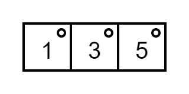
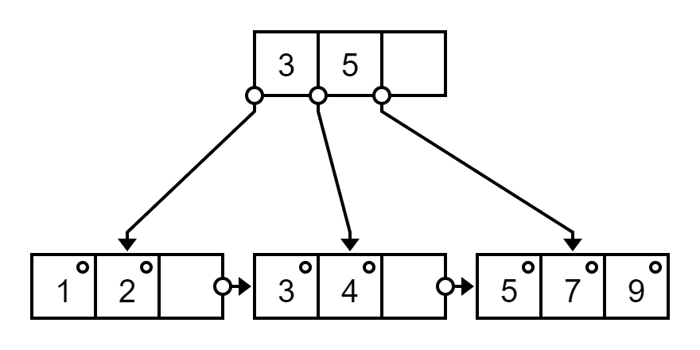
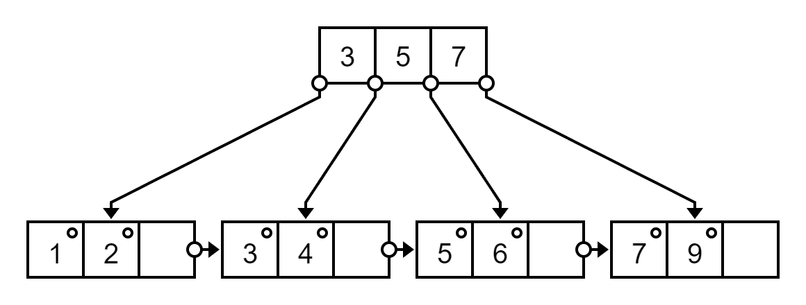
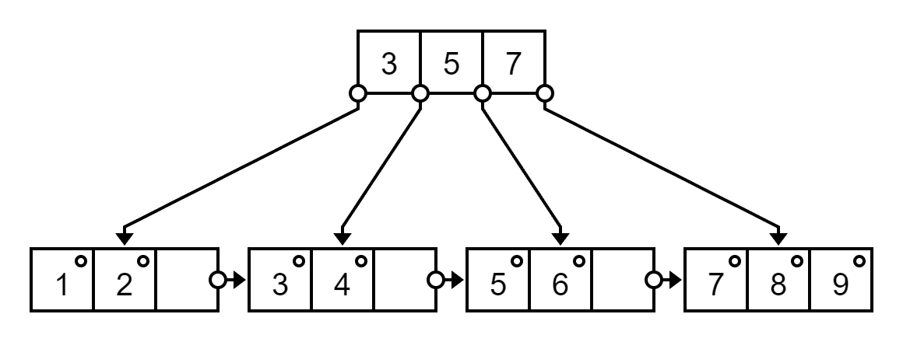
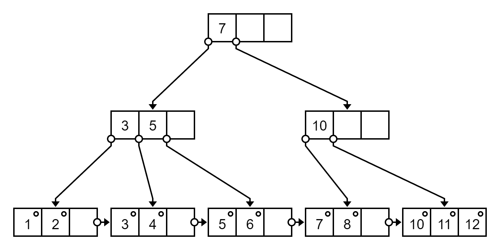

# B+ Tree

[B+ tree - Wikipedia](https://en.wikipedia.org/wiki/B%2B_tree)

> B+ 樹背後的想法是內部節點可以有在預定範圍內的可變數目的子節點
> 
> 因此，B+ 樹不需要像其他自平衡二叉搜尋樹那樣經常的重新平衡

`m` is order

For each node, `m` childs, `m - 1` keys

Three kind of node: root node, internal node, leaf node

For children / subtree / pointer

> Node maximum `m` children
> 
> Node minimum `ceil(m / 2)` children

For keys / elements

> Node maximum `m - 1` keys
> 
> Node minimum of `ceil(m / 2) - 1` keys (except root node)

For example, `m` is `4`:

`3` key and `4` children pointer

```
|    | k0 |    | k1 |    | k2 |    |
| p0 |    | p1 |    | p2 |    | p3 |
```

> 所有 leaf node 鏈結成一個單鏈表

All key in leaf node

## Left / right biasing

[Databases: left biasing and right biasing in B+ tree insertion](https://gateoverflow.in/91462/left-biasing-and-right-biasing-in-b-tree-insertion)

插入並且分裂時左邊 key 比較多還是右邊 key 比較多 (ceil vs floor in left right)

Compare element:

- Left biasing use \<= and >

- Right biasing use \< and \>=

Index when split

- Left biasing use left side max as index

- Right biasing use right side min as index

Wiki use left biasing, but most of the example in internet use right biasing (also in school teaching)

Result of left / right biasing with same insert order can be different (even can be different in depth of tree)

## Insertion 插入 (right biasing)

[5.29 B+ Tree Insertion | B+ Tree Creation example | Data Structure Tutorials - YouTube](https://www.youtube.com/watch?v=DqcZLulVJ0M)

當節點已滿

- 用中位數切分
  - Left have `floor((m + 1) / 2)`, right have `ceil((m + 1) / 2)`
- 當分裂的是 leaf node
  - 取出右邊最小 element (中位數) 作為 index 插入到 parent
- 當分裂的是 non-leaf node (internal or root)
  - 中位數作為 parent, use successor replace

### Example

For `m` = 4  B+ tree

Insert `1, 3, 5, 7, 9, 2, 4, 6, 8, 10`

<p class="h-100">



</p>

Insert `7`

It is `[1, 3, 5, 7]`, medium between `3` and `5`, by default it is right biasing, use `5` as index

<p class="h-250">


</p>

Insert `9`, `2`

<p class="h-250">


</p>

Insert `4`

It is `[1, 2, 3, 4]`, medium between `2` and `3`, use `3` as index

<p class="h-250">



</p>

Insert `6`

It is `[5, 6, 7, 9]`, medium between `6` and `7`, use `7` as index

<p class="h-250">



</p>

Insert `8`

<p class="h-250">



</p>

Insert `10`, It is `[7, 8, 9, 10]`, medium between `8` and `9`, use `9` as index

In parent, It is `[3, 5, 7, 9]`, medium between `5` and `7`, use `7` as index (move as parent)

Be care in non-leaf node, the index will move upper, and the replace with successor

<p class="h-350">


</p>

## Deletion 刪除

[5.30 B+ Tree Deletion| with example |Data structure & Algorithm Tutorials - YouTube](https://www.youtube.com/watch?v=pGOdeCpuwpI)

[Deletion from a B+ Tree](https://www.programiz.com/dsa/deletion-from-a-b-plus-tree)

Half full mean `ceil(m / 2) - 1`

(1) 刪除 node 後仍然多於 `ceil(m / 2) - 1` keys -> it is ok, just delete

(2) 刪除 node 後 less then `ceil(m / 2) - 1` keys
- Try and check 從 sibling node 兄弟節點 borrowing 借用, use successor as index
- If can't (after 借用 sibling node will less than half full), merge (delete index, use smallest as index)

(3) 刪除 node 是 index
- Use successor (replace by next node)

Check parent layer one by one until ok

### Example

Delete `9, 7, 8` in following B+ Tree

[Online sketcher](https://projects.calebevans.me/b-sketcher/)

```
9
3,5,7/11
1,2/3,4/5,6/7,8/9,10/11,12
```

<p class="h-350">


</p>

Delete `9`

`[10]` is less than half full, need borrow or merge

Sibling node `[11, 12]` will less than half full if borrowing

Merge sibling tree, delete index `11`, then remaining is `[10, 11, 12]`, index is `10`

In `[3, 5, 7]` and `[10]`, left side can borrow

`7` go to parent, right side use `10` as index

<p class="h-350">



</p>

Delete `7`

`[8]` is less than half full

Sibling node is `[10, 11, 12]`, can borrowing

Move `10` to left side, it is `[8, 10]`

Use successor `11` as index

Check parent, replace `7` with successor `8`

<p class="h-350">


</p>

Delete `8`

It is `[10]`, right side cannot borrowing, need merge

Merge, `[10, 11, 12]`, delete index `11`, use `10` as index

In `[3, 5]` and `[10]`, left side cannot borrowing, need merge

Merge, `[3, 5, 10]`, delete index `8`

<p class="h-250">


</p>

## Visualization Tool / Simulator

[B-Sketcher (also for B+ Tree)](https://projects.calebevans.me/b-sketcher/)

[B+ Tree Visualization](https://www.cs.usfca.edu/~galles/visualization/BPlusTree.html)

